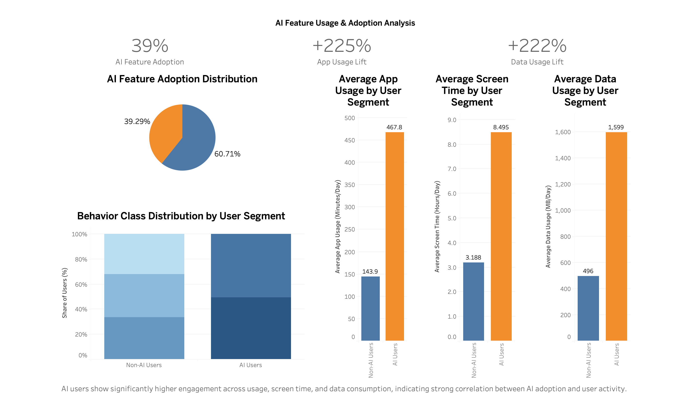

# 🤖 AI Feature Usage & Adoption Analysis

## Overview

This project analyzes user behavior to understand how adoption of AI-like features impacts engagement.

Since direct AI usage data was not available, a proxy variable was created to simulate AI feature adoption based on user activity patterns.

The goal is to identify whether users who engage more deeply with the product are more likely to adopt AI features, and how their behavior differs from others.

---

## Dataset

The dataset includes user-level behavioral data such as:

* App Usage Time (minutes/day)
* Screen On Time (hours/day)
* Data Usage (MB/day)
* Number of Apps Installed
* Device and demographic details
* User Behavior Class (1–5)

---

## Feature Engineering

A new column was created:

**AI_Feature_User (0 / 1)**

* Users with high app usage AND high screen time were classified as AI users
* This was used as a proxy to simulate AI feature adoption

This step reflects a real-world scenario where direct feature usage data may not be available.

---

## Tools Used

* SQL → Data analysis
* Tableau → Dashboard and visualization

---

## Key Metrics

* AI Feature Adoption Rate: **39%**
* App Usage Increase: **+225%** among AI users
* Data Usage Increase: **+222%** among AI users

---

## Dashboard

[View Interactive Dashboard](https://public.tableau.com/app/profile/pragati.kalnawat/viz/AIFeatureUsageAdoptionAnalysis/Dashboard1)

---

## Analysis & Insights

### AI Adoption

Approximately 39% of users were classified as AI feature users, indicating moderate adoption.

---

### Engagement

AI users show significantly higher engagement:

* Higher app usage
* Higher screen time
* Higher data consumption

This suggests that AI features are primarily used by highly active users.

---

### Behavioral Segmentation

AI users are more concentrated in higher behavior classes, indicating that:

* High-value users are more likely to adopt AI features
* AI usage is associated with deeper product engagement

---

## Conclusion

The analysis shows a strong relationship between AI feature adoption and user engagement.

While causation cannot be confirmed, the results suggest that AI features are most relevant for already engaged users.

This type of analysis can help product teams:

* Identify target users for AI feature rollout
* Improve engagement strategies
* Prioritize feature development

---

## Repository Structure

* dataset → CSV file
* analysis.sql → SQL queries
* ai_dashboard.png → Dashboard image
* README.md → Project documentation
